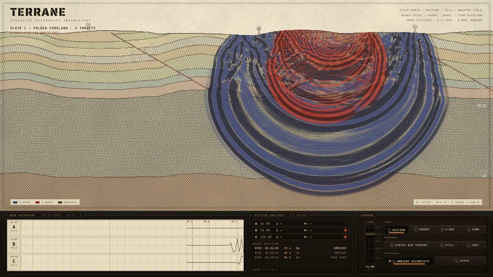
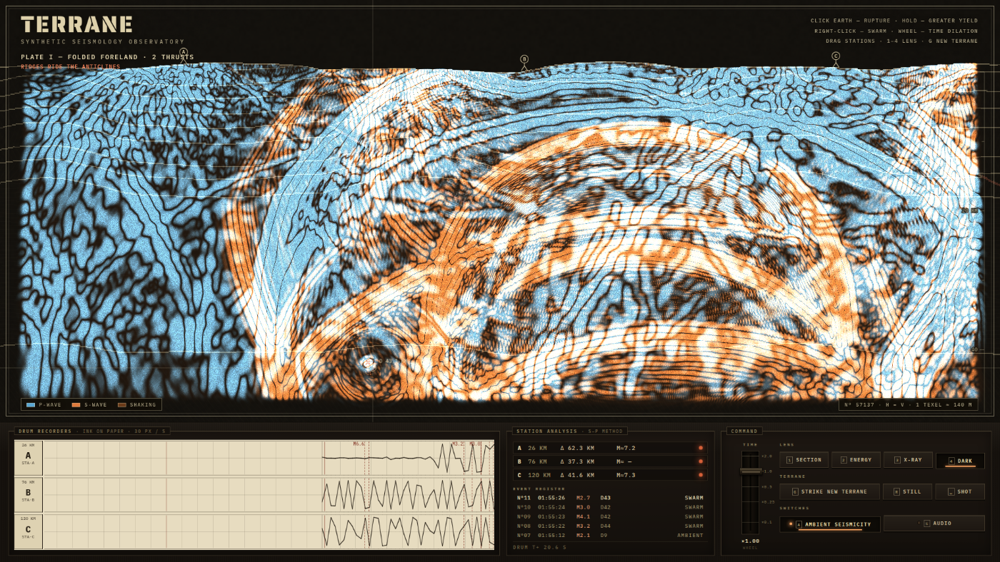

# TERRANE

**A synthetic seismology observatory.** A procedurally generated geological cross-section — folded strata, thrust faults, magma chambers, subducting slabs, ocean basins — rendered as a living 19th-century engraved survey plate, with a real elastic-wave simulation running through it on the GPU.

Click into the earth and it ruptures. P-waves (indigo ink) and S-waves (madder red) radiate with the four-lobed pattern of a real double-couple earthquake source, refract through velocity contrasts, reflect off the free surface and the Moho, get trapped and amplified in soft sediment basins — and go silent behind molten magma chambers, because shear waves cannot cross liquid. Three seismometer stations on the surface scribble everything onto ink drum recorders, pick P and S arrivals, and convert S–P intervals into hypocentral distances on a bakelite instrument shelf, the way observatories actually did it.



## Running it

```
npm install
npm run dev      # → http://localhost:5173
npm run build    # type-checks and bundles
```

Frontend-only, no accounts, no APIs, no external requests at runtime. Fonts (IBM Plex Mono, Saira Stencil One — both SIL OFL) are bundled from npm packages. Requires WebGL2 with float render targets (any normal desktop browser). Composed for a 1920×1080 desktop display.

## The instrument

Everything is discoverable from the hint line in the sky, but for the record:

| Control | Effect |
| --- | --- |
| **Click** the section | Rupture the earth at that point (a fault-plane preview appears while held) |
| **Click & hold** | Charge the yield — M 3.2 up to M 6.6 |
| **Right-click** | Earthquake swarm at that point |
| **Scroll wheel** | Time dilation, ×0.06 – ×2.5 (the drums and ambient seismicity slow with the planet) |
| **Drag a station** | Reposition it along the surface; its S–P readings follow |
| **1 – 4** | Lenses: SECTION (engraved plate) · ENERGY (isoseismal scorch record) · X-RAY (velocity tomograph) · DARK (phosphor darkfield) |
| **G** | Strike a new terrane — a fresh procedural plate: craton, folded foreland, rift, volcanic arc, or sediment basin |
| **Space** | Test shot at a seismogenic site |
| **R** | Still the field (clear all waves) |
| **A** | Ambient seismicity on/off — quakes cluster where the geology is weak: faults, melt roofs, and down the subducting slab (a Wadati–Benioff zone) |
| **S** | Audio: synthesized rumble, arrival thumps, panel clicks. **Off by default**; everything is generated in WebAudio, no samples |



## Why this concept

I wanted a piece where the *simulation is the artwork* — not a heatmap pasted onto a picture, but physics that draws in the visual language of the piece. Seismology turned out to be a perfect fit: wave refraction through folded strata is intrinsically beautiful, the scientific instruments of the field (drum recorders, travel-time charts, isoseismal maps) are already gorgeous graphic objects, and the physics produces discoverable *stories* — the S-wave shadow that reveals a hidden melt chamber, the basin that rings like a bell, deep quakes tracing the slab. It also let me commit hard to one art direction — engraved survey plate on a brutalist instrument shelf — instead of a generic web aesthetic.

## What's under the hood

- **Hand-rolled WebGL2, no engine.** The only runtime dependencies are React and two font packages.
- **GPU wave physics.** Two damped scalar wave fields (P and S) packed into one RGBA float texture, leapfrog-integrated in a ping-pong fragment shader at ~10 substeps per frame over a 1024-wide grid, with realistic velocity ratios (vs ≈ vp/1.74), per-material attenuation, absorbing sponge boundaries, and vs = 0 in liquids — so S-wave shadows behind melt and under oceans emerge from the math, not from scripting.
- **Double-couple sources.** Ruptures inject a delayed Ricker wavelet with the quadrupolar cos 2θ / sin 2θ radiation pattern of real earthquakes, oriented along a random fault plane (previewed while you hold the mouse).
- **Procedural geology.** Each terrane is generated from a seed: layered velocity stacks, sinusoidal + fBm folding, dipping faults with drag, melt lenses, subducting slabs, sea levels — emitted simultaneously as a physics texture (velocities, attenuation) and a styling texture (ink tint, hatch angle/density, contact edges).
- **The plate is drawn, not textured.** An "engraving" shader converts the styling texture into paper grain, aquatint mottle, per-layer hatching with hand-wobble, stipple for melt, broken liner for water, cross-hatch for mantle — rendered once per terrane into a static texture, so the per-frame compositor stays cheap. Waves are inked over it with wavefront-following engraving lines derived from the field gradient.
- **Analog instrumentation.** The drum pens are second-order underdamped mechanical arms — sharp arrivals overshoot and ring, ink pools when the pen moves slowly, hard hits clip against the rails. Arrival picking runs on the two channels separately with sub-frame threshold interpolation; S–P times become hypocentral distances via the terrane's average velocities.
- **Async GPU readback.** Station ground motion is probed on the GPU, packed to 16-bit fixed point, and read back through a fenced 4-slot PBO ring, so the seismographs never stall the render pipeline.

## Inspiration, and originality

A short research pass before building looked at what makes acclaimed interactive pieces land (instant motion, one obvious verb, committed period aesthetics, real scientific accuracy as a delight mechanic) — that calibration shaped decisions like the auto-firing opening shot, the cursor-following "CLICK TO RUPTURE" cue, and staggered station reactions. It also surfaced the closest existing things: educational tools like IRIS/EarthScope's *swaves* globe and Field Day Lab's *Earthquake!*, and academic wave-equation shader demos. Those confirmed the mechanic exists in education — as utilitarian applets — and that no polished creative piece combines a playable rupture mechanic with GPU elastic waves, drum seismograms, and an engraved-plate art direction. They were used strictly as calibration; no concept, name, layout, mechanic, visual identity, or code was taken from any of them.

**Originality note:** TERRANE was designed and written from scratch for this repository. It does not intentionally recreate any existing app, demo, game, or creative-coding example.
